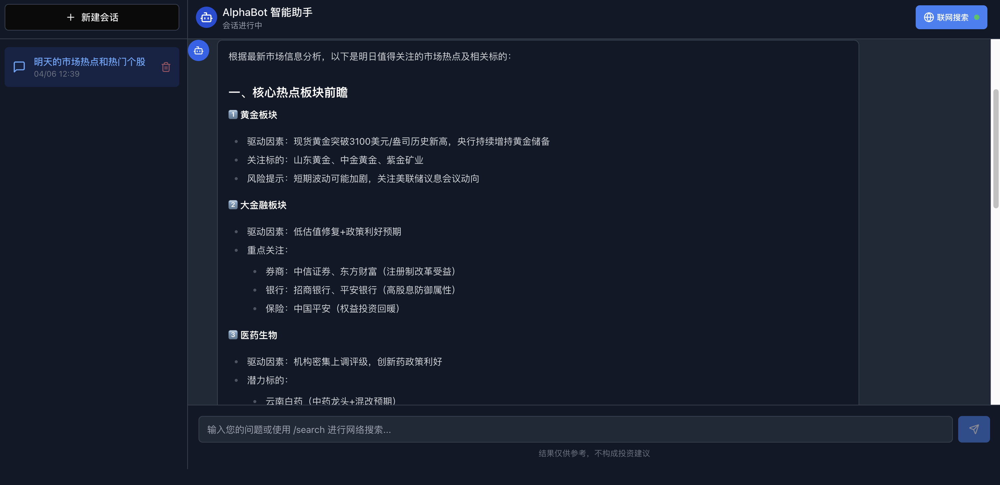

[中文](README.md)|English

# 🤖 AlphaBot - Your Intelligent Stock Analysis Assistant

> "In the stock market, it's not the smartest who make money, but the most disciplined." — Warren Buffett (probably never said this, but sounds right)

## 🎭 When AI Meets the Stock Market: A Battle of Rationality and Data

Welcome to the world of AlphaBot, where you'll find not just cold data analysis, but also heartwarming trading advice. We know you're using this application because:

- 📉 Last month's trades made you question your life choices
- 🧠 Your trading decisions are often guided by "I feel it will go up"
- 💸 You excel at "buying high and selling low"
- 🎰 You treat the stock market as a giant casino (and the house always wins)

Don't worry, we've all been there. AlphaBot was born to help you evolve from a "feeling-based trader" to a "data-driven investor."

## 🛡️ Disclaimer (Serious Face)

**Important: Before using this project, please confirm you understand the following facts**

1. **This is not a money printer**: This project cannot guarantee you'll become the next Buffett or Simons. If it could, we'd already be retired in the Maldives.

2. **Market risks**: Stock markets are risky, proceed with caution. Remember, the market is always right, even when it seems irrational.

3. **AI makes mistakes too**: Our AI models are smart, but they can't predict earthquakes, coups, or your neighbor suddenly deciding to sell all their stocks.

4. **User responsibility**: If you lose money after using this software, remember that you pressed the "buy" button, not us.

5. **Data sources**: We use data from third parties; if the data is wrong, it's really not our fault.

**By using this project, you agree to: maintain a smile regardless of profit or loss, because at least you gained valuable experience.**

## 🧙‍♂️ Core Features: From Data to Decisions

### 🤖 AlphaBot Agent Assistant (Newly Launched!)

- **Intelligent Q&A**: AI-powered financial advisor based on large language models, ready to answer your investment questions
- **Web Search**: Real-time access to the latest market news and company updates
- **Data Visualization**: Generate professional stock charts and analysis reports through natural language
- **Quantitative Strategies**: Recommend and explain suitable quantitative trading strategies based on your needs

### 📊 Multi-Source Data Support

- **Global Market Data**: Access global stock market data via Alpha Vantage
- **Chinese Market Data**: Access A-share market data through Tushare and AKShare
- **Real-time Updates**: Automatic synchronization of latest market data

### 🤖 AI Intelligent Analysis

- **Technical Analysis**: Trend and pattern analysis based on historical data
- **Fundamental Analysis**: Company financial indicators and industry comparison
- **Machine Learning Predictions**: Market forecasting using trained models
- **Large Language Model Analysis**: Deep market interpretation using OpenAI API

### 📈 Trading Assistant Functions

- **Stock Search**: Quickly find and filter stocks
- **Historical Data**: View historical prices and trading data
- **Technical Indicators**: Calculate and display common technical indicators
- **Risk Assessment**: AI-driven risk assessment and recommendations

## 🚀 Quick Start

### Method 1: Using Docker (Recommended)

The project provides Docker Compose configuration and a one-click deployment script for quick application setup.

#### Prerequisites

- Docker and Docker Compose installed
- A calm mind (this is important)

#### Deployment Steps

1. Clone the repository
```bash
git clone https://github.com/x-pai/alphabot.git
cd alphabot
```

2. Run the deployment script
```bash
./deploy.sh
```

3. Access the application
- Backend API docs: http://localhost:8000/api/v1/docs
- Frontend interface: http://localhost:3000


### Method 2: Manual Installation (For those who enjoy tinkering)

#### Backend

```bash
cd backend
pip install -r requirements.txt
# Configure .env file
python train_model.py  # Optional, train machine learning models
uvicorn app.main:app --reload
```

#### Frontend

```bash
cd frontend
npm install
npm start
```

Default Account Credentials: admin/admin123

## 🧩 Using AlphaBot Agent

After accessing the application, you can directly use the newly launched AlphaBot Agent assistant:

1. Click the "AI Assistant" button in the interface to enter the conversation screen
2. Input your financial questions or analysis needs
3. Enable the "Web Search" feature to get the latest information
4. View AI-generated professional analysis and recommendations



## 📝 Trader's Oath

When using AlphaBot, please silently recite the following oath:

1. I promise to follow data analysis, not my intuition
2. I promise to set stop-losses and strictly enforce them
3. I promise not to trade when emotionally charged
4. I promise to prioritize risk control
5. I promise to remember: preserving capital is the first priority in trading

## 🤝 Join Our "Rational Traders" Community

Official Account:
<div align="center">
  
</div>

WeChat Group:
<div align="center">
  
</div>

~~QQ Group: [Click to join the "AlphaBot Traders Alliance" chat group](https://qm.qq.com/q/ES8Fp8AdpY)~~

## 💰 Sponsor This Project

If AlphaBot has helped you avoid an impulsive trade or build a better trading system, please consider sponsoring us. Your support will be used for:

1. Server maintenance (because AI models are memory-hungry)
2. Data source subscriptions (quality data isn't free)
3. Developer's coffee (this is the most important)

<div align="center">
  
  <p>Scan with WeChat to sponsor (any amount, it's the thought that counts)</p>
</div>

### Sponsors Showcase

<table>
  <tr>
    <td align="center" width="180">
      <a href="https://example.com">
        
        <br />
        <b>Example Corporation</b>
      </a>
    </td>
    <td align="center" width="180">
      <a href="https://your-company.com">
        
        <br />
        <b>Your Company Name</b>
      </a>
    </td>
  </tr>
</table>

> Check our [sponsorship program](sponsors.md) for corporate sponsorship options.

## 🧠 Remember

> "Markets can remain irrational longer than you can remain solvent." — Keynes

But with AlphaBot, at least you can remain rational a bit longer.

Happy trading! Remember, sometimes the best trade is no trade at all.
